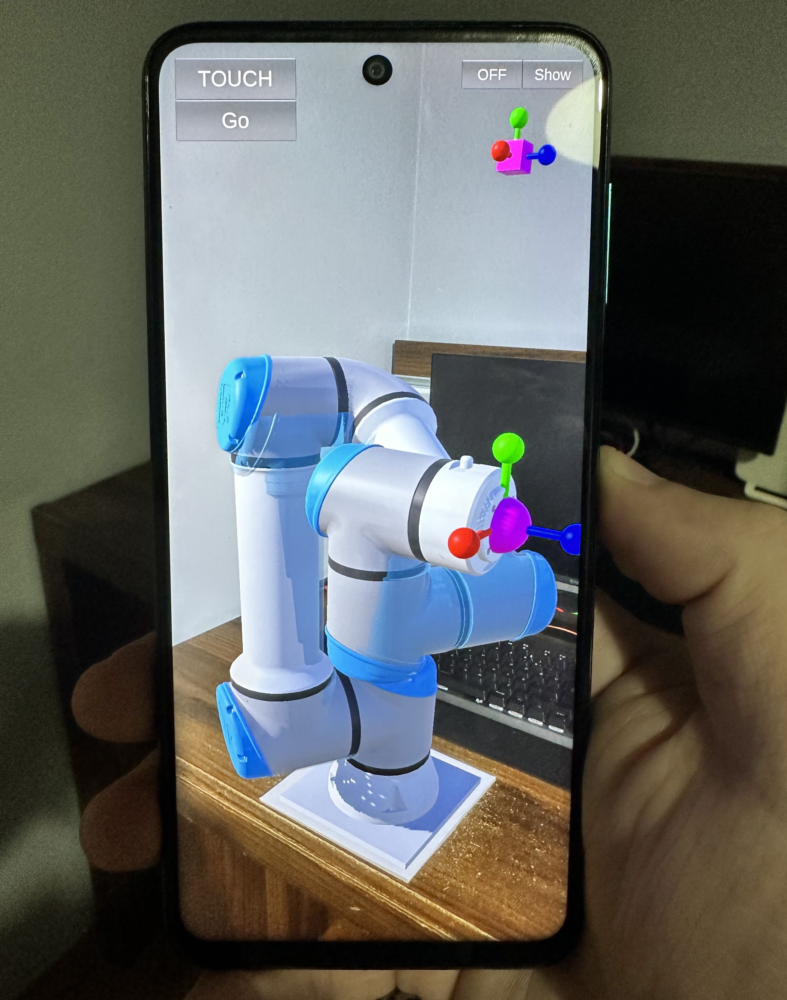

# Unity UR16e Robot Arm Control with Glove in Augmented Reality

  

This project combines the power of Unity, UR16e robot arm, and an augmented reality glove using ESP32 for wireless communication. The goal is controlling of the robot arm with hand tracking glove through an Android smartphone's augmented reality interface.

  

## Project Overview

In this project, I achieved the following key functionalities:

- Utilized inverse kinematics calculations for the UR16e robot arm within the Unity environment, allowing the end effector to move to desired positions.

- Created an augmented reality experience on an Android device, enabling users to visualize and interact with the robot arm in real-time.

- Implemented touch controls on the smartphone, allowing users to intuitively control the robot arm's movements.

- Utilized three MPU6050 gyro sensors connected to an ESP32 to capture the rotation angles of the upper arm, lower arm, and hand.

- Transferred these rotation angles from the ESP32 to the Unity environment wirelessly, enabling the Unity environment to accurately track the hand's position.

- Established communication between the ESP32 and Unity environment through a Local Host connection.

- Combined the tracked hand position with the UR16e robot arm's inverse kinematics calculations, enabling the robot arm's end effector to follow the hand's position.

- Demonstrated the robot arm's capabilities in an augmented reality setting, including observing the robot arm on a QR code marker and controlling it using the augmented reality glove.

# Getting Started

To set up the Unity augmented reality environment for this project, follow these steps:

1. **Install Unity Android Package:**
   - Start by installing the Unity Android package if you haven't already.
   
2. **Configure Vuforia Engine:**
   - In order for your phone's camera to recognize QR codes, we utilize Vuforia Engine.
   - After installing Unity, import the Vuforia Engine into your project.
   - Configure Vuforia to recognize QR codes. You can also use other images instead of QR codes.
   
3. **Inverse Kinematics (IK) for UR16e Robot Arm:**
   - For the inverse kinematics calculations of the UR16e robot arm, I relied on the GitHub repository provided by Damien Mazeas available at [https://github.com/mazeasdamien/sample_IK_UR16e](https://github.com/mazeasdamien/sample_IK_UR16e).
   
4. **MPU6050 Sensors and TCA9648a Module:**
   - Use an ESP32 microcontroller to collect rotation angles from three MPU6050 gyro sensors.
   - Employ the TCA9648a module for I2C communication with the three MPU6050 sensors.
   
5. **ESP32 and Quaternion Rotation Data:**
   - Utilize the ESP32 to gather quaternion rotation data from the sensors.
   - Transmit the quaternion rotation data via the client.print function to a Local Host.
   
6. **Unity Integration:**
   - In Unity, retrieve the rotation data from the Local Host.
   - Simulate the robot arm's movements in the virtual environment using an object that represents the arm.
   
7. **Tracking Hand Position:**
   - Calculate the hand's position from the arm's rotations.
   - Ensure that the robot arm moves to the calculated hand position.

These steps will guide you through the process of setting up and running the project. Make sure to adjust the configurations and dependencies according to your specific setup.

## Project Video

[Link to Project Video](https://www.youtube.com/watch?v=FRx_d1CK45s)
